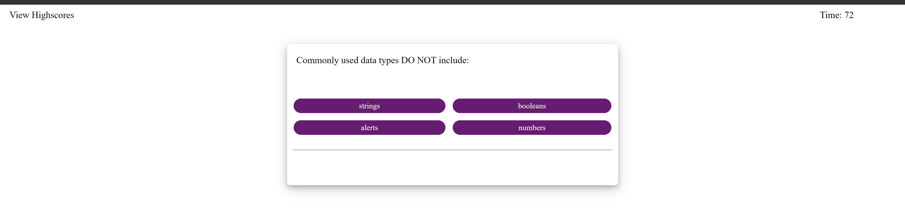

# Code Quiz

#### Purpose

The purpose of this project is to use function and combine with addEventListener to manuiuplate the screen and layout regarding the click of a mouse from the user. Also we need to generate to different screens as we click to the next question. On top of that the user can also submit their answer at the end of the quiz and see how they did compare to other people who had already taken the quiz before them.There is also a timer that the user must keep track of. They only get 15 second on each question, if they answer quick and correct they will score higher, and vice versa.

#### Functionality

The function of this project is to generate a web page that allow user to take the quiz and the quiz consists of multiple questions. The user can also track their progress as they take the quiz and see how well they did compare to other players at the end of the quiz. They can also put in their initials so it will be stored inside a local storage.

Some Javascript functions includes:
-Function
-addEventListener
-timeInterval
-Calculating the Score

Link to github page: https://ductran963.github.io/codeQuiz-Portfolio/

Code Quiz image:

